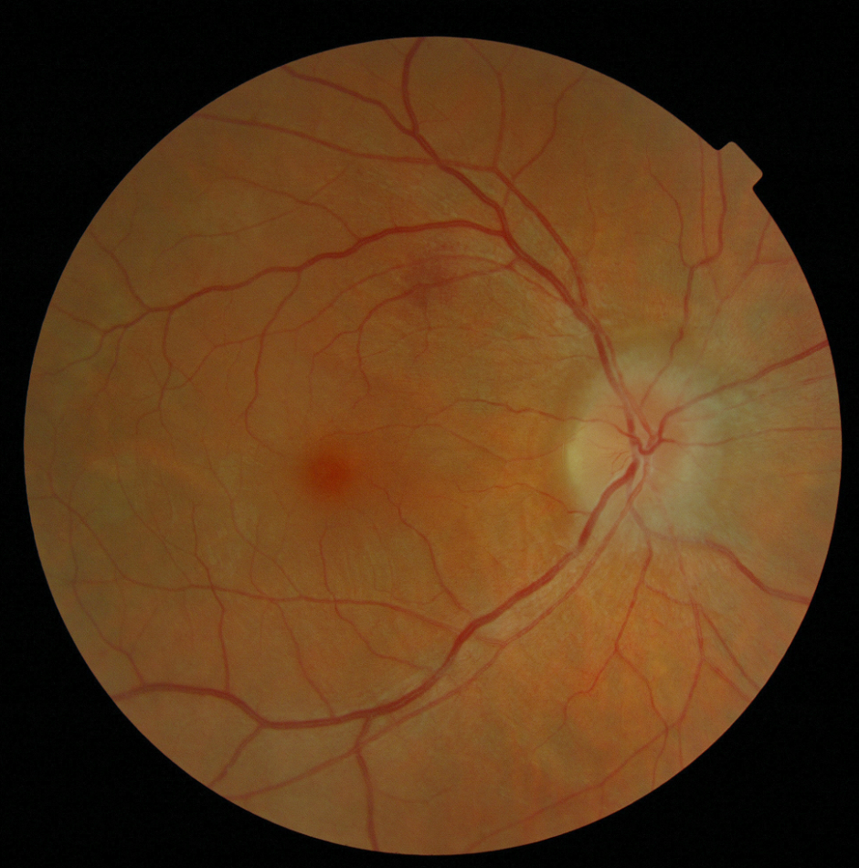
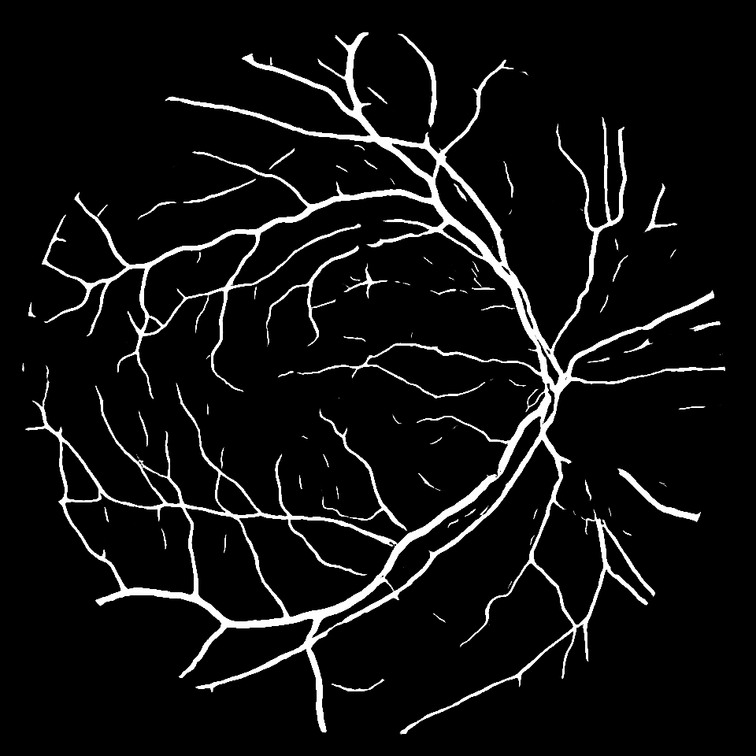
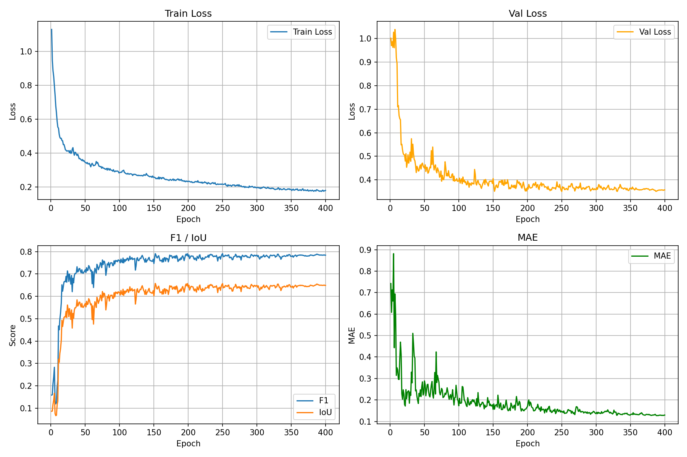
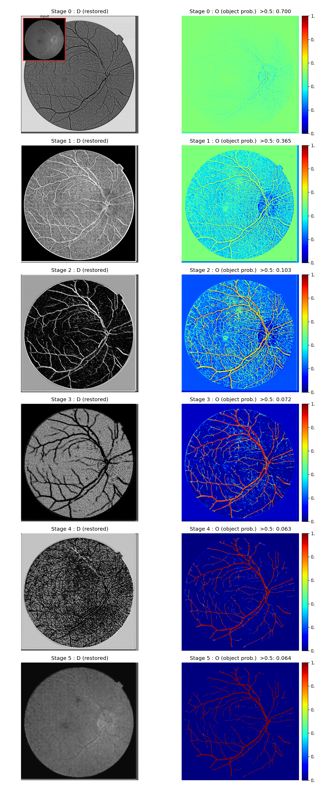

## 基于RPCANet++的眼部血管分割

注：本仓库是对论文 **RPCANet++: Deep Interpretable Robust PCA for Sparse Object Segmentation**的非官方手工复现，仅复现了眼部血管分割的部分，用作个人学习，可供参考。

- 原论文PDF：https://arxiv.org/abs/2508.04190
- 官方代码：https://github.com/fengyiwu98/RPCANet

## 简介
传统RPCA算法将图像分解为低秩部分和稀疏部分，但直接求解涉及大量的矩阵操作，计算量大且参数难以调优。针对以上问题，RPCANet++模拟了RPCA的迭代求解步骤，将其映射为深度神经网络，既保留了RPCA的物理假设，又利用神经网络的特性替代了手动调参，其可解释性可用于相关领域。

<table>
  <tr>
    <td></td>
    <td>→</td>
    <td></td>
  </tr>
</table>

## 环境依赖
- Python 3.14.3
- CUDA 12.8
- numpy 2.5.3
- opencv-python 5.0.0.93
- Pillow 12.3.0
- scikit-learn 1.8.0
- pytorch 2.12
- matplotlib 3.10.8

## 数据集
本项目使用STARE数据集(STructured Analysis of the Retina)用于训练，数据集可从官网获取：https://cecas.clemson.edu/~ahoover/stare/
下载好数据集后，请将原始图像和对应的label分别放置在`./datasets/images`下和`./datasets/labels`下。

## 参数配置
本项目训练和推理所需要的所有参数均可在`./configs/config.py`中配置。针对眼部血管分割任务，参照原论文配置：
```python
channel_expansion = 32  # 通道拓展数
lo = 6                  # OEM中∇S子网络中间层数量
ld = 3                  # IRM中中间层的数量
stage_num = 6           # 迭代数，影响网络参数量
```

## 训练
配置好模型参数并正确放置数据集后，运行以下命令开始训练：
```bash
python model_train.py
```
训练过程中，IoU最好的权重和最终权重将会保存在`./weight`下。参照原始论文配置，本项目对数据集以80/20进行分割，作为训练集与测试集；使用Adam优化器进行梯度下降，其中初始学习率设置为5e-4，使用多项式衰减策略，batch_size设置为4，训练400个epoch。
本项目使用一块RTX 4090 48G进行训练，训练参数变化如下图所示：


## 推理
训练好后，将你的原始图像放置在根目录下，命名为"test.png"（可以自行修改），随后运行以下命令：
```bash
python model_val.py
```
模型的预测结果将会放置在`./figures`下。
如果想要观看图像随各个stage的变化情况，可以运行以下命令输出各阶段的预测结果：
```bash
python stage_vis.py
```


## 项目结构
```
│  model_train.py     # 模型训练
│  model_val.py       # 模型推理
│  README.md          # README
│  stage_vis.py       # 各阶段可视化
│
├─configs
│  │  config.py       # 模型参数配置
│
├─datasets
│  │  vs_ds.py        # 数据集
│  │
│  ├─images: ...
│  ├─labels: ...
├─model
│  │  BackgroundApp.py  # BAM
│  │  ImageRes.py       # IRM
│  │  ObjectExtractor.py   # OEM
│  │  RPCANetPP.py    # RPCANet++
│
├─utils
│  │  GetLoder.py     # 获取dataloader
│  │  metrics.py      # 指标计算
│  │  Normalize.py    # 废弃物，无视即可（
│  │  SoftIOU.py      # SoftIOU损失函数的实现
│
└─weight
        best.pth
        last.pth
```

## 引用
```
@ARTICLE{10156866,
  author={Wu, Fengyi and Yu, Hang and Liu, Anran and Luo, Junhai and Peng, Zhenming},
  journal={IEEE Transactions on Geoscience and Remote Sensing}, 
  title={Infrared Small Target Detection Using Spatiotemporal 4-D Tensor Train and Ring Unfolding}, 
  year={2023},
  volume={61},
  number={},
  pages={1-22},
  doi={10.1109/TGRS.2023.3288024}}
```
